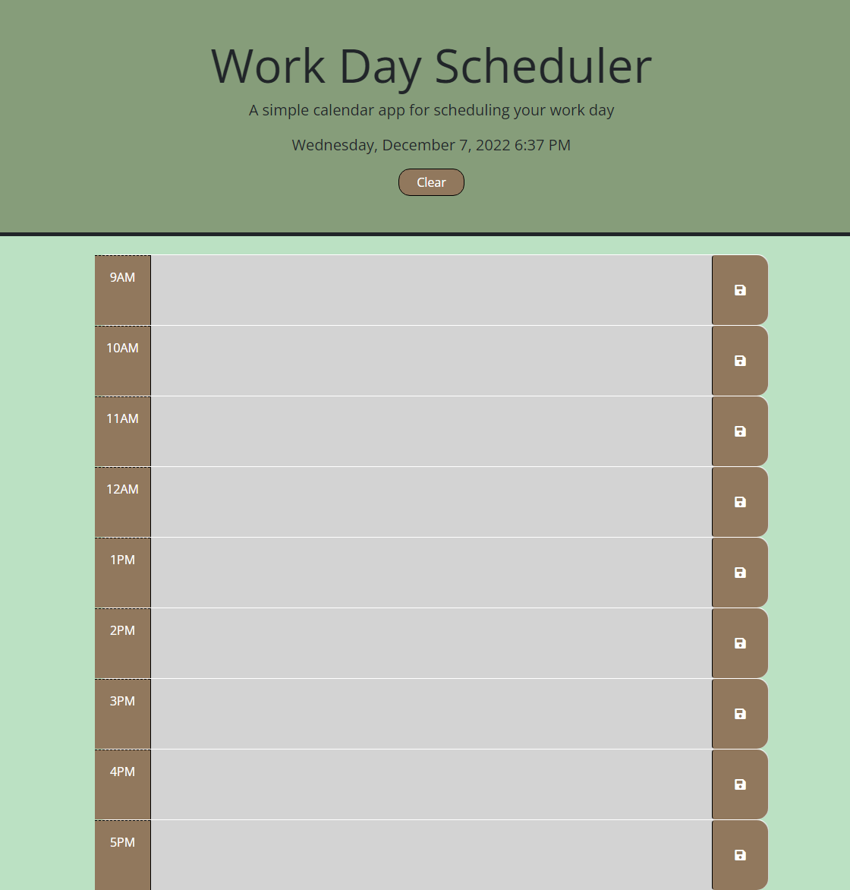

# Daily Planner

[Link to my project](https://cujion.github.io/Daily-Planner/)

## Table of Contents
- [Description](#description)
- [Visuals](#visuals)
- [License](#license)

## Description
* This is a Daily Organizing Planner that allows you to plan out your daily schedule and save that input to your local storage upon clicking the save icon on the right side of each section. This script uses Dayjs to update the local date and time in order to color coordinate each time slot. Green representing future hours, Red representing current hour and Grey representing past time. I also included a clear button in the header section to clear out the text input field along with your local storage. This webpage uses bootstrap for styling and layout of the page, external font styling, Jquery library, and utilizes local storage to save data to your local machine in order to update the planner on page reload.

## Visuals

## License
* MIT License

* Copyright (c) [2022]] [Christopher Bonime]

* Permission is hereby granted, free of charge, to any person obtaining a copy
of this software and associated documentation files (the "Software"), to deal
in the Software without restriction, including without limitation the rights
to use, copy, modify, merge, publish, distribute, sublicense, and/or sell
copies of the Software, and to permit persons to whom the Software is
furnished to do so, subject to the following conditions:

* The above copyright notice and this permission notice shall be included in all
copies or substantial portions of the Software.

* THE SOFTWARE IS PROVIDED "AS IS", WITHOUT WARRANTY OF ANY KIND, EXPRESS OR
IMPLIED, INCLUDING BUT NOT LIMITED TO THE WARRANTIES OF MERCHANTABILITY,
FITNESS FOR A PARTICULAR PURPOSE AND NONINFRINGEMENT. IN NO EVENT SHALL THE
AUTHORS OR COPYRIGHT HOLDERS BE LIABLE FOR ANY CLAIM, DAMAGES OR OTHER
LIABILITY, WHETHER IN AN ACTION OF CONTRACT, TORT OR OTHERWISE, ARISING FROM,
OUT OF OR IN CONNECTION WITH THE SOFTWARE OR THE USE OR OTHER DEALINGS IN THE
SOFTWARE.